# SkiStore

## Description

The project is an online store specializing in ski equipment. It integrates with Stripe for secure and reliable payment processing. Users can create accounts, log in, manage their cart, and place orders. JWT Token is used for user authentication and authorization, ensuring secure access. Additionally, some data is cached to improve performance and reduce latency, resulting in a more efficient user experience.

## Used technologies

**Backend**

- .NET 8.0

**Frontend**

- Angular v17

**Databases**

- PostgreSQL - for storing products and users data,
- Redis - for basket and caching

**Containerization**

- Docker - for databases

## Build and run

To run the project perform the following steps:

1. Install Node.js 18.3 or higher
2. Install ASP.NET core 8.0 or higher
3. Install Docker
4. Install the Angular CLI:
   `npm install -g @angular/cli`
5. (**Optional** - without it you can't finalize the order. The entire ordering process works, only the final screen is different - instead of the ordering success screen, there is an error screen)

   5.1. Add local listener in stripe webhooks (https://dashboard.stripe.com/test/webhooks/create?endpoint_location=local - instruction) to the endpoint https://localhost:5001/api/payments/webhook with events:
    - payment_intent.payment_failed
    - payment_intent.succeeded
   `stripe listen -f https://localhost:5001/api/payments/webhook -e payment_intent.payment_failed,payment_intent.succeeded`
   You will get a WebHook key which you need to paste in step 5.2.
   
   5.2. Add to `API/appsettings.Development.json` your Stripe API keys:
   ```
   "StripeSettings": {
     "PublishableKey": "YOUR STRIPE PUBLISHABLE KEY",
     "SecretKey": "YOUR STRIPE SECRET KEY",
     "WhSecret": "YOUR WEBHOOK KEY"
   },
   ```
   
   5.3. Change stripe publishable key in `client\src\app\checkout\checkout-payment\checkout-payment.component.ts` to yours

6. Open a command prompt in root folder and run `docker-compose up --detach`
7. Go to the project's `client` folder
8. Run `npm install`
9. Run `ng serve` to start the Angular build process
10. Open a new command window in the root of the project and run the following commands:

```
dotnet restore
dotnet build
dotnet watch run --project API
```

11. Visit https://localhost:4200/ in the browser

## Screenshots

**Products with filters**
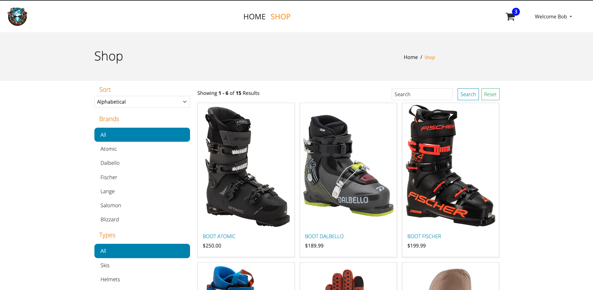
**Product details**
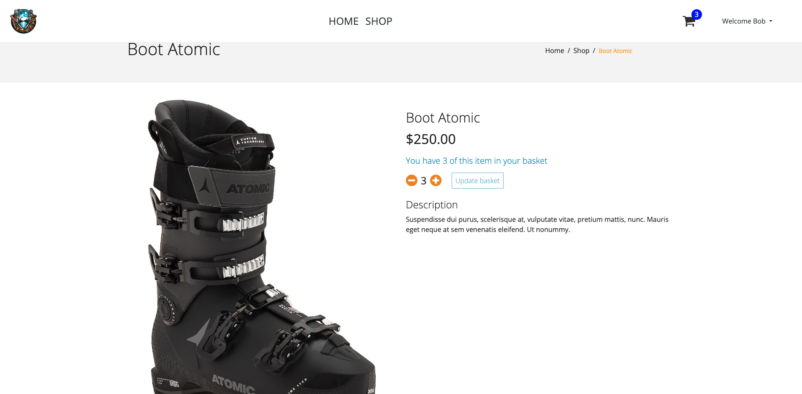
**Cart**
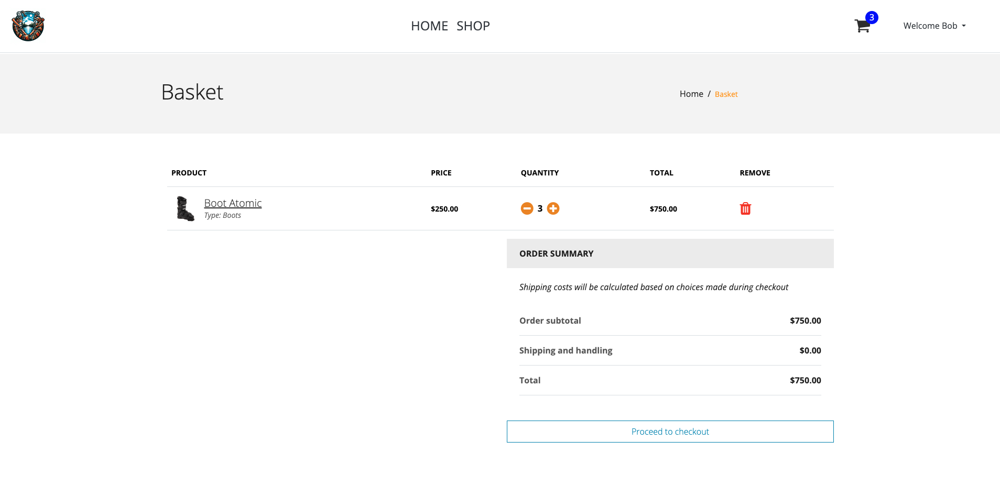
**Finalizing order (address)**
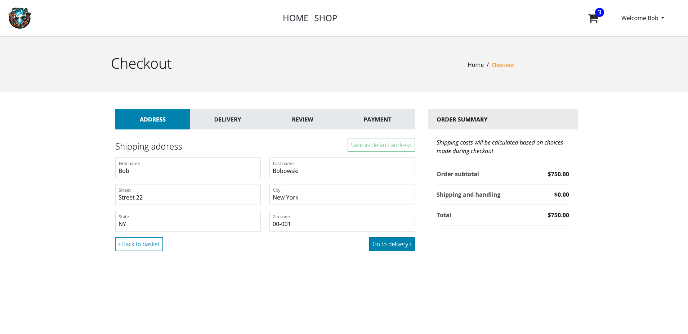
**Finalizing order (delivery)**
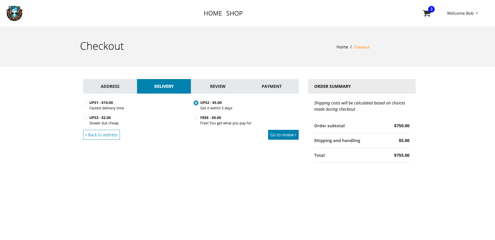
**Finalizing order (review)**
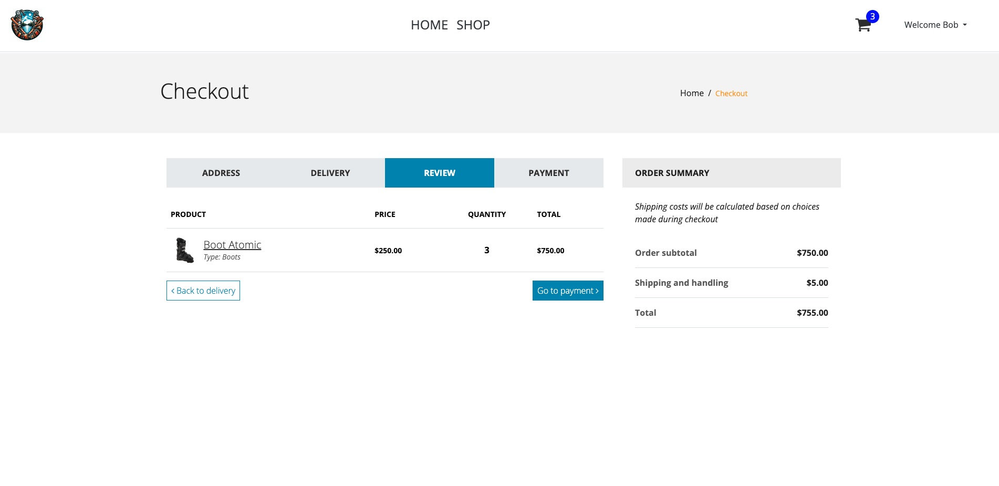
**Finalizing order (payment)**
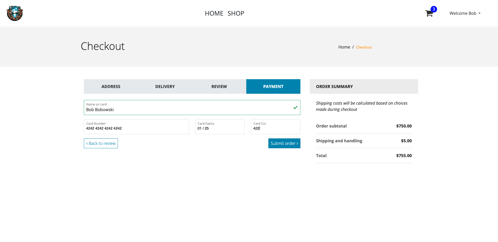
**Finalized order**
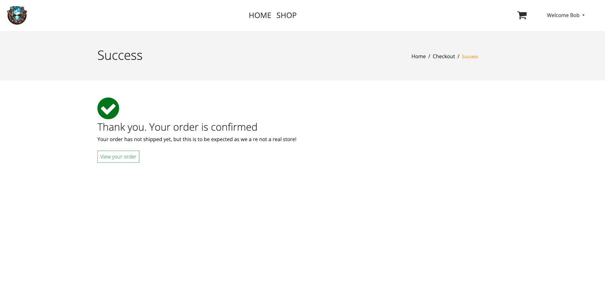
**Orders**
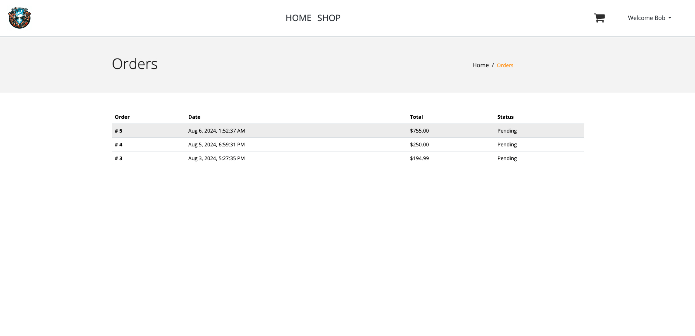
**Login**
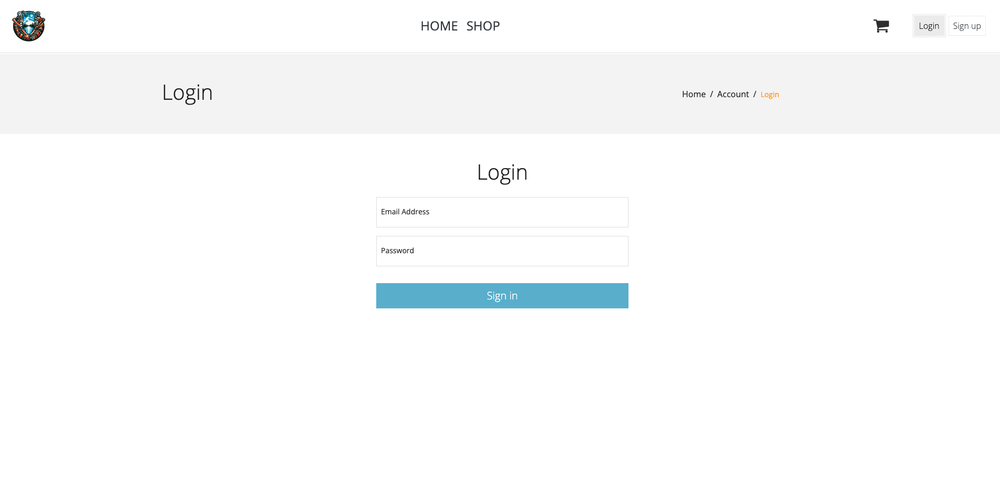
**Register**
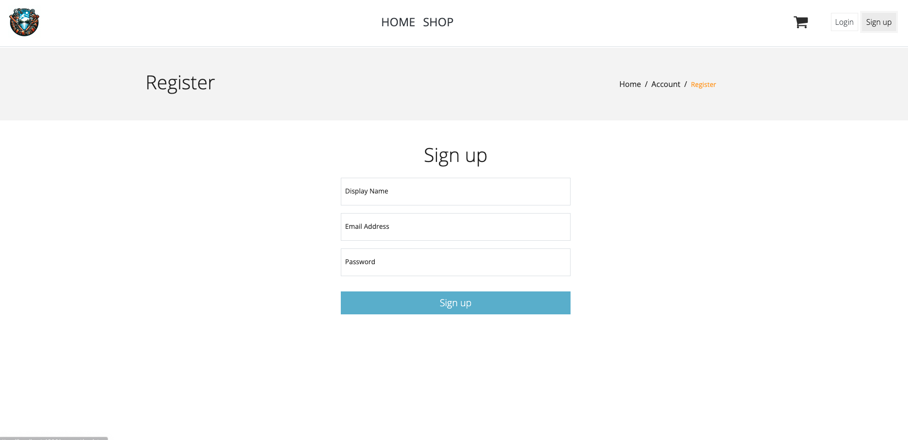
